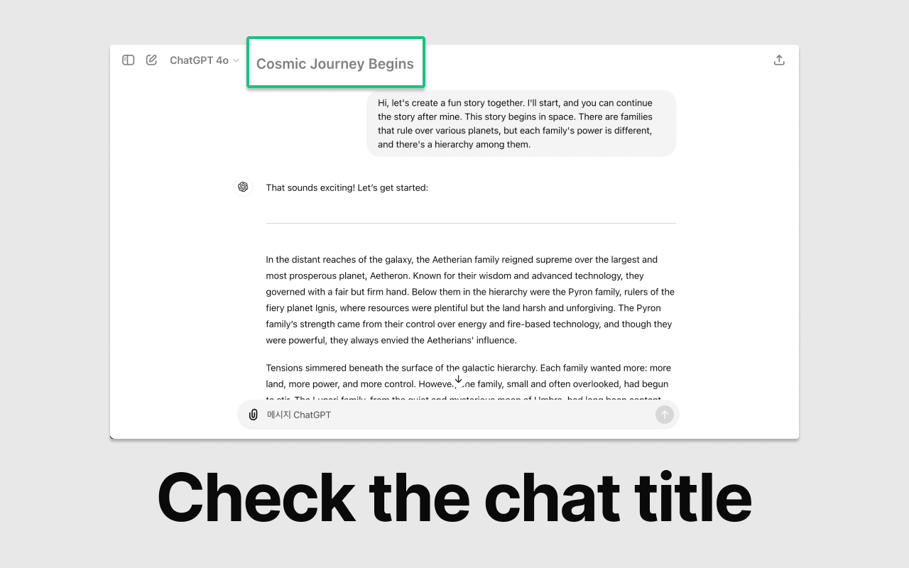
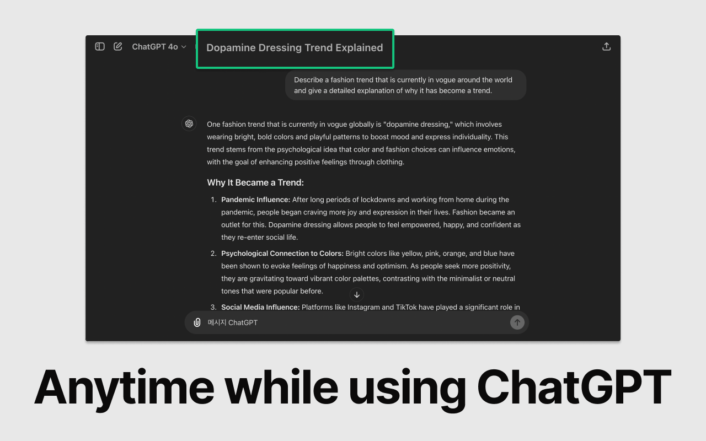

# Title Viewer For ChatGPT

  
  

## Title Viewer for ChatGPT

Lightweight and efficient, check the chat title anytime while using ChatGPT.

## FEATURES

- Display the chat title at the top for easy reference
- Supported on browser windows larger than 768px

## CONTACT

If you have feedback, send me an email at hyunyikim11@gmail.com.

## PRIVACY

No data is collected from you.
